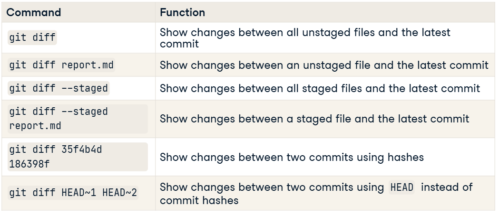
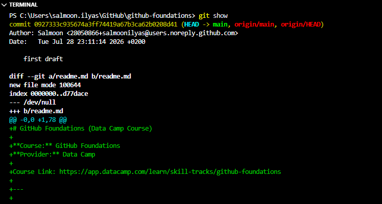
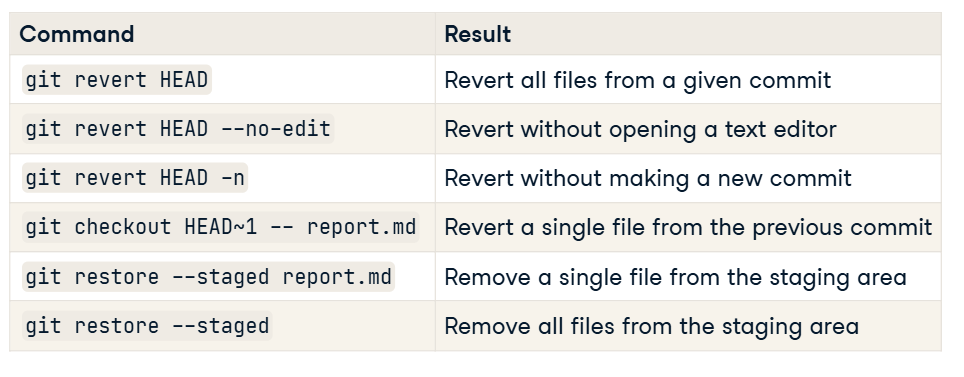

# GitHub Foundations (Data Camp Course)

**Course:** GitHub Foundations
**Provider:** Data Camp

Course Link: https://app.datacamp.com/learn/skill-tracks/github-foundations

---

1. Introduction to Git

---

## 1.1 Introduction to Git  
The benefits and fundamentals of Git for version control in software and data projects.

- Introduction to version control
    Version control allows track and change files in different states or changes overtime.
    List all files and sub-directories in the current folder: ls

- Navigating the shell  
    Get current working directory: pwd
    Move to another directory: cd <directory name>

- Checking the version of Git
    Checking git version: git --version

- Creating repos  
  Git repo is directory containing files and sub-directories, and Git Storage.

- Converting an existing project
    git init

- Creating a new repo  
    git init <project name>

- Staging and committing files  
    Add the file to PC, then add it to staging area by initializing, and then save it to git by using commit.

- Adding a file to the staging area  
    git add <file name>
    git add . :memo: **Note:** The "." adds all files, directories and subdirectories to the commit.

- Saving files
    git commit -m "Description of the commit"

---

## 1.2 Version history  
Covers how to compare files at different points in time, and restore files to their previous state.

- Viewing the version history  
    Git commit structure have three parts:
        1. Commit: Contains the metadata - author, log message, commit time.
        2. Tree: Tracks the names and locations of the files and directories in the repo.
                 like a directory - mapping keys to files/directories.
        3. Blob: Binary Large Object
                 may contain data of any kind
                 a compressed snapshot of a file's contents.

    Visualizing the commit structure:
    

- Viewing a repository's history  
    git log :memo: **Note:** Shows the list of commit in chronological order.

- Finding the log message  
    git log :memo: **Note:** Shows commit name, Author, date and message.

- Version history tips and tricks  
    git show 227fa856 :memo: **Note:** Only need first 8-10 characters of the commit. The output displays the log entry for that commit at the top, followed by a diff output showing changes between the file in that commit and the current version in the repo. At the bottom, it shows the data.

![Git show [commit]](.\images\1.2.version-history.png)

- Limiting the view of a repo's history  
    git log -3 :memo: **Note:** Shows last three commits.

- Viewing a file's history  
    git log report.md :memo: **Note:**Filters commit by report name. 
    git log -2 report.md :memo: **Note:** Filter by report name and only show last two commits.

- Filtering commits by date  
   git log --since ="Month Day Year" --until ="Month Day Year" :memo: **Note:** Filter commits by date, the until part is optional.
    Acceptable filter date formats, could be in natural language format or in conventional date formats such as: git log --since "2 weeks ago".

- Comparing versions
    git diff :Difference between two versions.

    Summary

- Comparing staged files  
    git diff report.md :compare the last committed version of report with a modified version that is unstaged.
    
    The line in light blue font shows the comparison of what changed between the two versions. The minus 0 and 0 indicate that version A starts at line 0 and has 0 lines, and the plus 1 and 78 show that version B starts at line 1 and has 78 lines.

    git diff --staged report.md :compare the last committed version of report with a modified version that is in the staging area.
    git diff --staged :compare the last committed version of report with all staged files.

- Comparing to the second most recent commit
    git diff commit-id-B commit-id-A
    git diff HEAD~1 HEAD

- Restoring and reverting files  
    Used to resolve problems.
    git revert : reinstated the revious versions and makes a commit. Restores all files updated in the given commit.

- Unstaging a file  
    to unstage single file:
    git restore --staged summary_statistics.cvs
    git restore --staged :remove all fules from the staging area

- Reverting a commit
    git revert HEAD : Save and exit using Crtl+O Enter Crtl +X
    git revert --no-edit HEAD :avoid opening text editor
    git revert -n HEAD : Revert without committing (brings files to staging area) -n = no commit
    git revert works on commits, not individual files.
    git checkout :To revert a single file
    git checkout HEAD~1 --report.md

    

---

2. Intermediate Git

---

## 2.1 Introduction to Git  

---

## 1. Branches in Git  
Discover the concept of branches in Git, enabling continuous development and integration of code to drive your software and data projects forward!

- **Introduction to branches**  
Default branch => main

git branch : To view the branch
git switch main :-Switch to main branch

- **Creating new branches**  
git branch new-branch-1 :Creates a new branch
git switch -c new-branch-2 :Creates a new branch and switch to it

:memo:  **Note:** when we create a new branch, it is common to say that we are "branching off". If we create the speed-test branch from the main branch, then we are branching off main.

- **Checking the number of branches**  
git branch : To view the number of branches

- **Modifying and comparing branches**  
- **Renaming branches**  
git branch -m feature_dev chatbot

- **Deleting branches**  
- git branch -d chatbot
:memo: **Note:** If we haven't merged the chatbot branch into main the -d flag will produce an error. If we still want to delete this branch, we run the same command but use an uppercase -D flag instead. We see the same output. Beware though, that while we can recover deleted branches, it's not easy. So, we should make sure we are confident that we won't need the branch later before deleting it.

- **Comparing branches**  
git diff commitid1 commitid2

- **Merging branches**  

- **Merging two branches**  
git switch main
git merge source-ai-asssitant
git merge source-ai-assistant main

- **Correctly using branches**  
--

---

## 2. Collaborating with Git  
Discover how to use Git for collaborative projects, handling merge conflicts, and synchronizing your local repos with remotes!

- **Merge conflicts**  
--
- **Reducing the risk of conflict**  
--
- **Resolving a merge conflict** 
-# Open the conflicting file
nano README.md

-# Resolve conflict by editing the file
-# Save and exit
-# Save: Control + O, Enter
-# Exit: Control + X

-# Stage the resolved file
git add README.md
-# Commit the changes
git commit -m "Resolved merge conflict in README"

images/2.2-resolving-conflict.png

- **Introduction to remotes**  

- **Cloning a repo**  
-# Clone a remote repo from GitHub
git clone path-to-project-repo
git clone https://github.com/datacamp/project

adding new project name:
git clone path-to-project new-local-project-name

-# Add a new remote
git remote add george https://github.com/george_datacamp/repo

List all remotes associated with the repo:
git remote
git remote -v

- **Defining and identifying remotes**  

- **Pulling from remotes**  

- **Fetching from a remote**  
git fetch to retrieve branches from a remote without merging.
git fetch origin
fetch from remote main branch:
git fetch origin main

--After fetching, we need to synchronize content between the remote and local repos. To do this, we perform a merge of the remote into our local repo. If we don't specify a local branch, the merge will be from the remote's main branch into the local branch that we are currently located in. The output is the same as if we merged two local branches, showing parent commit hashes, the type of merge, and what files changed.
git merge origin

- **Pulling from a remote**  
git pull, which combines fetch and merge.
git pull remote-name remote-branch
git pull origin main

- **Pushing to remotes**  
- 
- **Pushing to a remote**  
-# Example of pushing changes from local main to remote origin
git push remote local-branch
git push origin main

- **Congratulations**  

---

## Overview
A complete, XP?based curriculum to learn GitHub from zero to collaboration-ready.

## Chapters
### 1. Introduction to GitHub
Core concepts, repo creation, README formatting.

### 2. Working with Repos
Files, branches, permissions, and Personal Access Tokens.

### 3. Collaboration with GitHub
Forking, cloning, issues, pull requests, and teamwork workflows.

## Progress Tracking
- Total XP: 3000+
- Status: In progress

Introduction to GitHub Products: A Complete Guide

4. Intermediate GitHub Concepts

Introduction to GitHub Codespaces
